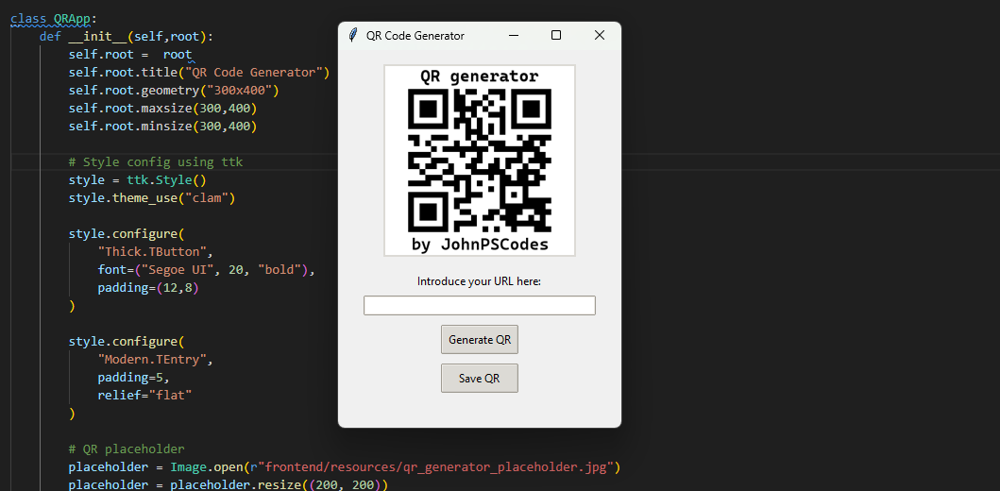

# QR Code Generator

A desktop application built with **Python** and **Tkinter** to easily generate and save QR codes.  

## Features

- User-friendly **Tkinter GUI**.  
- Generate **QR codes** from URLs.  
- Automatic URL validation using `validators`.  
- Real-time QR preview inside the app.  
- Option to **save QR codes** as image files (`.png`).  

## Technologies Used

- **Python 3**  
- **Tkinter** (frontend GUI)  
- **qrcode** (QR code generation)  
- **Pillow (PIL)** (image processing)  
- **validators** (URL validation)  

## Project GUI

## Project Showcase Gif

